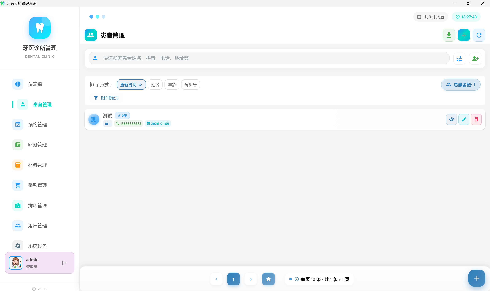
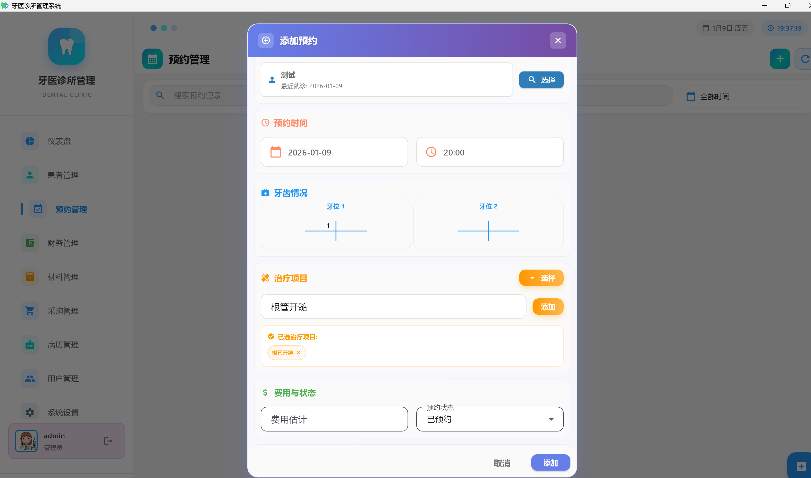
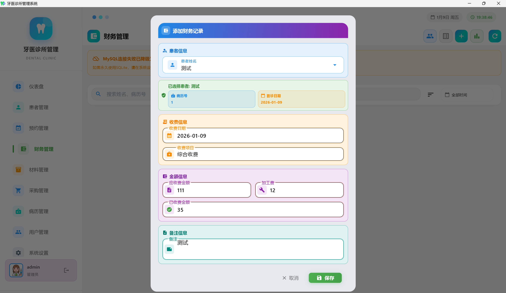
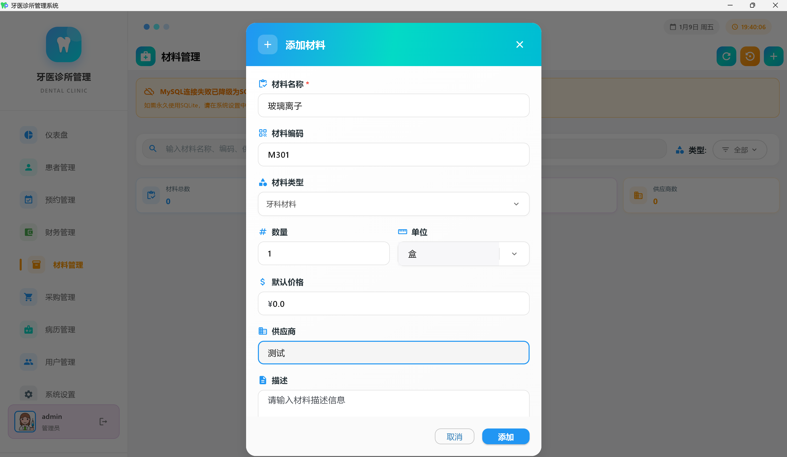
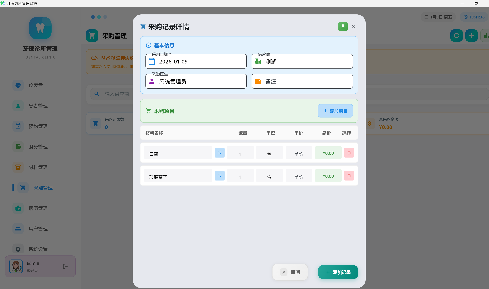
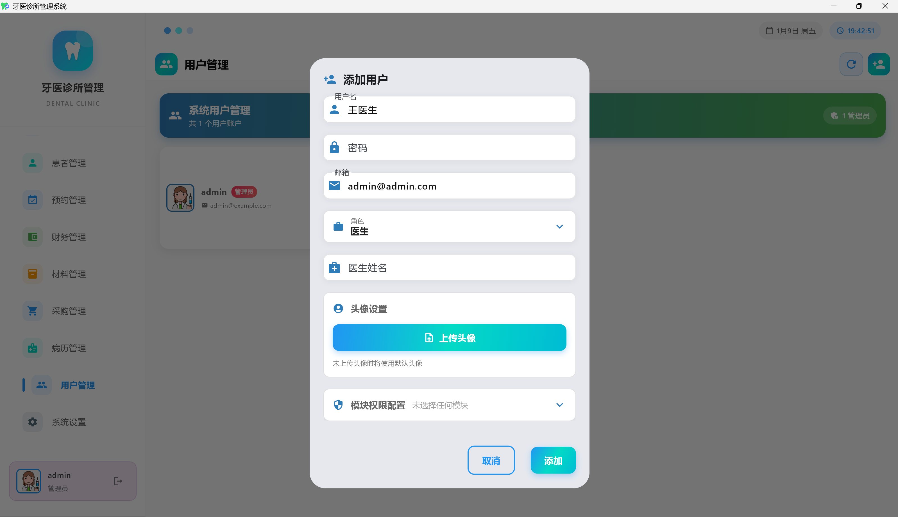
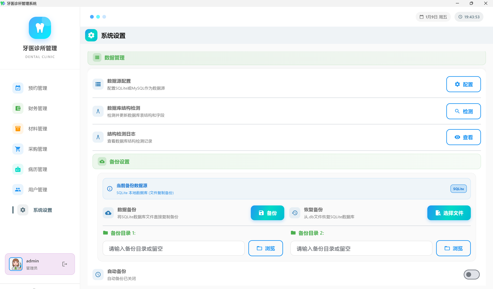

# 牙医诊所管理系统

<div align="center">

## ⚠️ 重要声明 / IMPORTANT NOTICE

### 🔒 官方唯一正规项目声明

**本项目是牙医诊所管理系统的唯一官方开源版本，请认准以下官方信息：**

- **官方仓库地址**：[GitHub - Happyeveryweek/dentist_app](https://github.com/Happyeveryweek/dentist_app.git)
- **项目状态**：100% 免费开源，采用 MIT 开源协议
- **收费声明**：本项目及其所有功能完全免费，任何人不得以此项目名义进行收费

### 🚨 防诈骗提醒

**请注意以下重要事项：**

1. **唯一性声明**：本 GitHub 仓库是该项目的唯一官方发布渠道
2. **免费声明**：本项目永久免费，不存在任何付费版本或收费服务
3. **防诈骗警告**：如有任何个人或组织以此项目名义进行收费、售卖或提供付费服务，均为诈骗行为
4. **官方支持**：技术支持仅通过 GitHub Issues 提供，不通过任何付费渠道
5. **代码完整性**：完整源代码均在此仓库公开，无隐藏或付费解锁功能

### 📢 如发现侵权或诈骗行为

如果您发现有人：
- 🚫 以此项目名义进行收费或售卖
- 🚫 声称拥有"付费版本"或"专业版本"
- 🚫 要求付费获取"完整功能"或"技术支持"
- 🚫 冒充官方团队进行商业活动


### 💡 使用建议

- ✅ 仅从本官方 GitHub 仓库下载源代码
- ✅ 遇到问题请在 GitHub Issues 中免费咨询
- ✅ 欢迎 Fork 项目进行二次开发（遵循 MIT 协议）
- ✅ 商业使用请遵循开源协议要求

---

</div>

<div align="center">

[](https://opensource.org/licenses/MIT)
[](https://flutter.dev/)
[](https://github.com/your-username/dentist_app)

### 🌟 如果这个项目对您有帮助，请给我们一个 Star！⭐

**您的支持是我们持续改进的动力** 💪

[](https://github.com/your-username/dentist_app/stargazers)
[](https://github.com/your-username/dentist_app/network/members)
[](https://github.com/your-username/dentist_app/watchers)

---

### 📢 参与项目

- 🌟 **给项目加星** - 点击右上角的 ⭐ Star 按钮
- 🍴 **Fork 项目** - 创建您自己的副本进行开发
- 👀 **Watch 项目** - 获取项目更新通知
- 🐛 **报告问题** - 在 [Issues](https://github.com/your-username/dentist_app/issues) 中反馈问题
- 💡 **提出建议** - 在 [Discussions](https://github.com/your-username/dentist_app/discussions) 中分享想法
- 🤝 **贡献代码** - 提交 Pull Request 参与开发

---

</div>

## 🎉 为什么选择我们？

<div align="center">

### 🚀 **完全免费开源** | 💻 **跨平台支持** | 🔒 **数据安全可控** | 🎨 **现代化界面**

</div>

> **💡 特别提醒**：如果您觉得这个项目有价值，请不要忘记点击 ⭐ **Star** 支持我们！您的每一个 Star 都是对开发团队最大的鼓励！

## 📋 开源协议

本项目采用 **MIT 开源协议**，详情请查看 [LICENSE](LICENSE) 文件。

## 🏥 系统概述

牙医诊所管理系统是一款基于 Flutter 开发的现代化诊所管理软件，专为牙科诊所设计。系统提供完整的患者管理、预约调度、财务管理、材料库存等功能，支持多平台部署和多种数据库后端。

### 🎯 适用范围

**推荐使用场景**：
- ✅ **个人诊所**：适合单个医生或小型团队的私人诊所
- ✅ **独立牙科诊所**：功能完整，满足日常诊所管理需求
- ✅ **初创诊所**：轻量级解决方案，快速上手使用

**不推荐使用场景**：
- ❌ **多诊所连锁**：系统功能相对基础，不适合复杂的连锁管理
- ❌ **大型医疗机构**：缺乏企业级功能，如高级报表、复杂工作流等
- ❌ **多分支机构**：暂不支持跨机构的统一管理和数据整合

> **重要提示**：本系统目前处于持续开发阶段，功能相对基础。虽然能够满足单个诊所的日常管理需求，但对于需要复杂业务流程、高级统计分析或多机构管理的场景，建议选择更成熟的商业解决方案。

### 🌟 核心特性

- **跨平台支持**：同时支持 Windows 桌面端和 Android 移动端
- **双数据库支持**：支持 SQLite 本地数据库和 MySQL 远程数据库
- **智能数据同步**：SQLite 与 MySQL 之间的智能数据同步机制
- **现代化界面**：Material Design 风格的直观用户界面
- **权限管理**：基于角色的用户权限控制系统
- **数据安全**：配置文件加密存储，数据备份恢复功能

### 💻 系统要求

#### Windows 客户端
- **操作系统**：Windows 10 或更高版本（64位）
- **内存**：至少 4GB RAM（推荐 8GB）
- **存储空间**：至少 500MB 可用空间
- **处理器**：Intel Core i3 或同等性能的 AMD 处理器
- **网络**：可选（使用 MySQL 时需要网络连接）

#### Android 客户端
- **操作系统**：Android 6.0 (API level 23) 或更高版本
- **内存**：至少 2GB RAM（推荐 4GB）
- **存储空间**：至少 200MB 可用空间
- **处理器**：ARM64 或 x86_64 架构
- **网络**：可选（使用 MySQL 时需要网络连接）

### 🗄️ 数据库支持

#### SQLite（本地数据库）
- **优势**：无需配置，开箱即用，数据存储在本地
- **适用场景**：单机使用，小型诊所，离线环境
- **默认配置**：系统首次启动时自动创建

#### MySQL（远程数据库）
- **优势**：支持多用户并发，数据集中管理，支持远程访问
- **适用场景**：多用户环境，大型诊所，需要数据共享
- **配置要求**：需要 MySQL 5.7 或更高版本

## 📱 系统模块

### 1. 患者管理模块



**功能概述**：完整的患者信息管理系统，支持患者档案建立、病历记录、治疗历史追踪等。

**具体功能**：
- 患者基本信息管理（姓名、联系方式、病历号等）
- 患者病历记录和治疗历史
- 患者材料使用记录和图片管理
- 智能搜索功能（支持拼音搜索和首字母搜索）
- 患者数据导入导出功能
- 患者信息统计和报表生成

### 2. 预约管理模块



**功能概述**：高效的预约调度系统，支持预约创建、修改、取消和提醒功能。

**具体功能**：
- 预约日程管理和日历视图
- 预约状态跟踪（待确认、已确认、已完成、已取消）
- 医生排班管理
- 预约冲突检测和提醒
- 预约统计和分析报表
- 批量预约操作

### 3. 财务管理模块



**功能概述**：全面的财务管理系统，包括收入支出记录、财务报表和统计分析。

**具体功能**：
- 收入支出记录管理
- 财务分类和标签管理
- 财务报表生成（日报、月报、年报）
- 收支统计和趋势分析
- 财务数据导出功能
- 多币种支持

### 4. 材料库存管理模块



**功能概述**：专业的牙科材料库存管理系统，支持材料分类、库存监控和采购管理。

**具体功能**：
- 材料分类管理（药品、器械、耗材等）
- 库存数量监控和预警
- 材料采购记录和供应商管理
- 材料使用记录和成本分析
- 库存盘点和调整功能
- 材料有效期管理

### 5. 采购管理模块



**功能概述**：完整的采购流程管理，从采购计划到入库验收的全流程跟踪。

**具体功能**：
- 采购计划制定和审批
- 供应商信息管理
- 采购订单创建和跟踪
- 采购成本统计和分析
- 采购历史记录查询
- 采购报表生成

### 6. 用户权限管理模块



**功能概述**：基于角色的用户权限管理系统，支持多角色用户和细粒度权限控制。

**具体功能**：
- 用户账户创建和管理
- 角色定义和权限分配
- 用户登录认证和会话管理
- 操作日志记录和审计
- 密码策略和安全设置
- 用户活动统计

### 7. 系统设置模块



**功能概述**：系统配置和维护功能，包括数据库设置、备份恢复、系统参数配置等。

**具体功能**：
- 数据库连接配置（SQLite/MySQL 切换）
- 数据备份和恢复功能
- 系统参数配置
- 数据同步设置
- 系统日志查看
- 软件更新检查

### 8. 数据同步模块


**功能概述**：智能的数据同步系统，支持 SQLite 与 MySQL 之间的数据同步。

**具体功能**：
- 自动数据同步配置
- 同步状态监控和日志
- 冲突检测和解决
- 增量同步和全量同步
- 同步计划任务设置
- 同步性能优化

## 🚀 快速开始

### 环境准备

1. **安装 Flutter SDK**
   ```bash
   # 下载并安装 Flutter SDK 3.7.2 或更高版本
   # 配置环境变量
   ```

2. **安装依赖**
   ```bash
   flutter pub get
   ```

### Windows 端部署

1. **构建 Windows 应用**
   ```bash
   cd windows_app
   flutter build windows --release
   ```

2. **运行应用**
   ```bash
   flutter run -d windows
   ```

### Android 端部署

1. **构建 Android APK**
   ```bash
   flutter build apk --release
   ```

2. **安装到设备**
   ```bash
   flutter install
   ```

### 数据库配置

#### SQLite 配置（默认）
- 系统首次启动时自动创建 SQLite 数据库
- 默认用户：`admin` / `123456`
- 数据库文件位置：应用数据目录

#### MySQL 配置
1. 在系统设置中配置 MySQL 连接参数
2. 测试连接确保配置正确
3. 系统将自动创建必要的表结构
4. 默认用户：`admin` / `123456`

## 📖 使用说明

### 首次使用

1. **启动应用**：双击可执行文件或从应用列表启动
2. **登录系统**：使用默认账户 `admin` / `123456` 登录
3. **配置数据库**：根据需要选择 SQLite 或 MySQL
4. **创建用户**：为诊所工作人员创建用户账户
5. **开始使用**：录入患者信息，创建预约等

### 数据迁移

系统支持 SQLite 与 MySQL 之间的数据迁移：
- **SQLite → MySQL**：在设置中配置 MySQL 连接，系统自动同步数据
- **数据备份**：定期备份数据库文件，确保数据安全
- **数据恢复**：支持从备份文件恢复数据

## 🛠️ 开发指南

### 项目结构

```
dentist_app/
├── lib/                    # 主要源代码（Android 端）
│   ├── models/            # 数据模型
│   ├── providers/         # 状态管理
│   ├── screens/           # 界面页面
│   ├── widgets/           # 自定义组件
│   └── utils/             # 工具类
├── windows_app/           # Windows 端源代码
├── android/               # Android 平台配置
├── windows/               # Windows 平台配置
└── assets/                # 资源文件
```

### 技术栈

- **前端框架**：Flutter 3.7.2+
- **状态管理**：Provider
- **本地数据库**：SQLite
- **远程数据库**：MySQL
- **UI 框架**：Material Design
- **图表组件**：FL Chart
- **文件操作**：Path Provider

### 贡献指南

1. Fork 本项目
2. 创建特性分支 (`git checkout -b feature/AmazingFeature`)
3. 提交更改 (`git commit -m 'Add some AmazingFeature'`)
4. 推送到分支 (`git push origin feature/AmazingFeature`)
5. 创建 Pull Request

## 📄 免责声明与法律声明

**重要提示：使用本软件即表示您已阅读、理解并同意以下免责声明条款。**

### 🔒 项目正规性与防诈骗声明

1. **官方唯一性**：本 GitHub 仓库（your-username/dentist_app）是该项目的唯一官方发布渠道，任何其他渠道发布的版本均非官方版本。

2. **完全免费**：本项目及其所有功能完全免费开源，不存在任何付费版本、专业版本或收费服务。

3. **防诈骗警告**：如有任何个人或组织以本项目名义进行以下行为，均为诈骗：
   - 💰 要求付费购买"完整版"或"专业版"
   - 💰 声称需要付费解锁某些功能
   - 💰 提供付费技术支持或安装服务
   - 💰 以本项目名义进行任何形式的收费活动

4. **知识产权保护**：本项目受 MIT 开源协议保护，任何违反协议的商业行为将承担法律责任。

### ⚖️ 使用风险与责任声明

**🚨 重要免责声明：开发者对使用本项目造成的任何问题、损失或后果不承担任何责任！**

1. **完全免责**：本软件按"现状"提供，开发者不提供任何明示或暗示的保证。使用者需自行承担使用本软件的所有风险和后果。

2. **数据风险**：开发者不对以下情况承担任何责任：
   - 数据丢失、损坏、泄露或被盗
   - 系统崩溃或数据库故障
   - 备份失败或恢复错误
   - 任何形式的数据安全问题

3. **医疗风险**：开发者不对以下情况承担任何责任：
   - 因软件错误导致的医疗事故或纠纷
   - 患者信息管理错误
   - 预约调度失误
   - 任何医疗相关的决策错误

4. **财务风险**：开发者不对以下情况承担任何责任：
   - 财务数据计算错误
   - 收费记录丢失或错误
   - 财务报表不准确
   - 任何经济损失

5. **法律风险**：开发者不对以下情况承担任何责任：
   - 违反当地法律法规的使用行为
   - 隐私保护法规违规
   - 医疗数据保护法规违规
   - 任何法律纠纷或诉讼

6. **技术风险**：开发者不对以下情况承担任何责任：
   - 软件Bug或功能缺陷
   - 系统兼容性问题
   - 性能问题或运行缓慢
   - 安全漏洞或被攻击

7. **商业风险**：开发者不对以下情况承担任何责任：
   - 业务中断或停滞
   - 客户流失或投诉
   - 声誉损失
   - 任何商业损失或机会成本

8. **使用后果**：开发者不对因使用本软件而产生的任何直接、间接、偶然、特殊、惩罚性或后果性损害承担责任，包括但不限于：
   - 利润损失
   - 数据损失
   - 业务中断
   - 声誉损害
   - 第三方索赔

9. **技术支持**：开发者不承诺提供任何技术支持、维护或更新服务。GitHub Issues 仅为社区交流平台，不构成技术支持承诺。

10. **责任上限**：即使在最不利的情况下，开发者的责任也不会超过零（0）元人民币。

### 🚨 特别提醒

- **唯一官方渠道**：请仅从本 GitHub 仓库获取项目源代码
- **免费使用**：本项目永久免费，如遇收费要求请立即举报
- **开源透明**：所有源代码完全公开，无隐藏功能
- **社区支持**：技术问题请通过 GitHub Issues 免费咨询

**使用本软件即表示您完全理解并接受上述免责声明。如果您不同意这些条款，请勿使用本软件。**

---

## 🚨 最终免责声明

**请在使用前仔细阅读：**

本开源项目仅供学习、研究和参考使用。开发者明确声明：

1. **零责任承担**：对于因使用本软件而导致的任何问题、损失、损害或后果，开发者概不负责。

2. **风险自担**：使用者应充分评估使用风险，并自行承担所有可能的后果。

3. **无保证声明**：本软件不提供任何形式的保证，包括但不限于适用性、可靠性、准确性保证。

4. **法律免责**：在法律允许的最大范围内，开发者免除所有责任和义务。

**再次提醒：使用本软件的一切风险和后果由使用者自行承担，开发者不承担任何责任！**

---

## 📞 联系方式

<div align="center">

### 🌟 喜欢这个项目？

**请给我们一个 Star ⭐，让更多人发现这个项目！**

[](https://star-history.com/#your-username/dentist_app&Date)

</div>

- **项目地址**：[GitHub Repository](https://github.com/Happyeveryweek/dentist_app) - 🌟 **别忘了给我们 Star！**
- **问题反馈**：[GitHub Issues](https://github.com/Happyeveryweek/dentist_app/issues) - 🐛 报告 Bug 或提出问题
- **功能建议**：[GitHub Discussions](https://github.com/Happyeveryweek/dentist_app/discussions) - 💡 分享您的想法和建议
- **项目动态**：[Watch 项目](https://github.com/Happyeveryweek/dentist_app/subscription) - 👀 获取最新更新通知

## 📜 许可证

本项目采用 MIT 许可证 - 查看 [LICENSE](LICENSE) 文件了解详情。

MIT 许可证允许您：
- ✅ 商业使用
- ✅ 修改代码
- ✅ 分发软件
- ✅ 私人使用

但需要：
- 📋 包含许可证和版权声明
- 📋 声明更改内容

## 🙏 致谢

感谢所有为这个项目做出贡献的开发者和用户！

<div align="center">

### 🌟 Star 历史

[](https://starchart.cc/your-username/dentist_app)

### 💝 支持项目

如果这个项目对您有帮助，请考虑：

- ⭐ **给项目加星** - 这是免费的，但对我们意义重大！
- 🐛 **报告问题** - 帮助我们改进项目质量
- 💡 **提出建议** - 分享您的想法和需求
- 🤝 **贡献代码** - 成为项目的贡献者
- 📢 **推荐给朋友** - 让更多人受益

**您的每一份支持都是我们前进的动力！** 🚀

</div>

---

**© 2024 牙医诊所管理系统. 保留所有权利.**

<div align="center">

[](https://opensource.org/licenses/MIT)
[](https://github.com/your-username/dentist_app)
[](https://github.com/your-username/dentist_app/graphs/contributors)

**🌟 如果您喜欢这个项目，请给我们一个 Star！⭐**

</div>