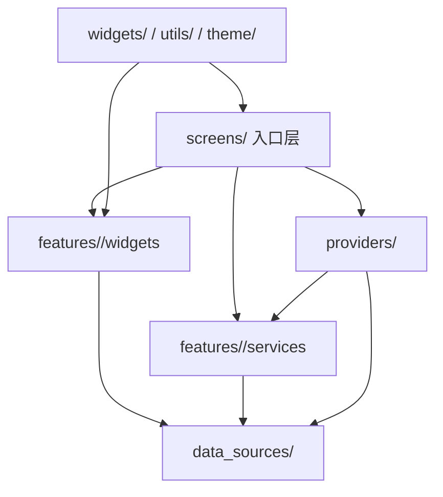

# Windows App 开发架构与目录规范

日期：2026-06-01

范围：`D:\Data\android_project\dentist_app\windows_app`

本文是 `windows_app` 后续开发的长期规范。后续无论是 Codex、Claude Code 还是人工开发，默认都按本文执行。

## 1. 目标

本项目的目标不是继续把文件拆到最小，而是维持一套长期稳定、可维护、可定位、可扩展的结构。

核心目标：

- 结构清晰，文件一眼能找到。
- 职责明确，避免一个文件同时干 UI、状态、查询、校验、导航。
- 排查问题更快，入口层、业务层、数据层边界明确。
- 增加功能更容易，新功能能按固定位置落盘。
- 减少混用和耦合，避免同一职责分散到多个不相关目录。

## 2. 结构总原则

### 2.1 以“职责”决定文件位置

不要先看文件有多少行，再决定放哪。

先问三个问题：

1. 这个文件负责什么？
2. 它只服务一个模块，还是多个模块？
3. 它更像页面入口、模块组件、业务逻辑，还是数据访问？

答案决定目录，而不是行数决定目录。

### 2.2 不为“文件少”而合并

以下情况不应作为独立目标：

- 纯粹为了减少文件数量而合并。
- 纯粹为了把小文件塞回大文件。
- 纯粹为了让目录看起来整齐。

只有合并后能真实降低理解成本、减少重复跳转、减少重复依赖，才值得做。

### 2.3 不为“拆分”而拆分

以下情况不应继续拆：

- 拆完只得到一个没有实际价值的壳文件。
- 拆完只是换了文件名，没有减少复杂度。
- 拆完让同一职责被拆成更难理解的碎片。

如果拆分不能明显降低复杂度，就不做。

## 3. 分层架构

`windows_app` 采用“入口层 + 模块层 + 业务层 + 数据层 + 公共层”的结构。



### 3.1 `screens/`

职责：

- 页面路由入口。
- 页面级编排。
- 组合模块组件。
- 管理页面生命周期、跳转和顶层状态绑定。

不放：

- 大量业务规则。
- 数据库访问。
- 与当前页面无关的可复用组件实现。

### 3.2 `features/<module>/`

职责：

- 某个业务模块自己的私有实现。
- 该模块专用的 UI、service、helper、状态辅助、弹窗、section、卡片等。

建议子目录：

- `widgets/`：模块私有 UI 组件、dialog、section、card、row、table、empty state。
- `services/`：模块业务规则、校验、聚合、同步、初始化、计算。
- `helpers/`：纯辅助方法、状态辅助、格式化、常量、映射、轻量构造器。
- `models/`：仅当该模块存在模块私有模型时使用。

### 3.3 `providers/`

职责：

- 应用级状态。
- 跨模块协调。
- 入口初始化和全局流程编排。

不要把明显属于单个模块的业务逻辑继续堆到 `providers/`。
如果逻辑只服务一个模块，优先放到 `features/<module>/services`。

### 3.4 `data_sources/`

职责：

- 所有数据库访问。
- SQLite / MySQL 的具体实现。
- 模块级数据访问接口。

原则：

- 接口与实现分离。
- SQLite 与 MySQL 物理分离。
- 不把查询逻辑拉回 `Provider`。
- 不把不同模块的数据访问揉成一个大文件。

### 3.5 `services/`

职责：

- 跨模块业务服务。
- 不属于某个单一模块的通用流程。

如果服务只服务一个模块，优先放入 `features/<module>/services`。

### 3.6 `widgets/`

职责：

- 跨模块共享的通用 UI。
- 与模块无关的基础组件。

模块专用 UI 不要放在这里。

### 3.7 `utils/`

职责：

- 纯工具函数。
- 与业务模块无强绑定的通用能力。

### 3.8 `models/`

职责：

- 多模块共享的领域模型。
- 全局通用 DTO / 数据结构。

模块专有模型优先留在模块内，只有确实共享时再上升到根级 `models/`。

### 3.9 `theme/`

职责：

- 主题、颜色、字号、全局视觉规范。

不要把业务组件塞进 `theme/`。

## 4. 文件放置规则

### 4.1 页面入口怎么放

如果文件承担的是“页面路由入口”，放到 `screens/`。

典型命名：

- `*_screen.dart`
- `*_screen_widgets.dart`
- `*_screen_parts.dart` 仅允许临时使用，完成后必须收口或删除

### 4.2 模块私有 UI 怎么放

如果组件只服务某个模块，放到 `features/<module>/widgets/`。

典型命名：

- `*_dialog.dart`
- `*_section.dart`
- `*_card.dart`
- `*_item.dart`
- `*_widget.dart`
- `*_components.dart` 仅在明确作为模块内部聚合入口时使用，且必须有实际收益

### 4.3 模块业务逻辑怎么放

如果文件负责：

- 初始化
- 校验
- 连接管理
- 计算
- 聚合
- 同步
- 权限判断

优先放到 `features/<module>/services/` 或 `features/<module>/helpers/`。

### 4.4 数据访问怎么放

所有数据访问文件统一遵循：

- 接口文件：`<module>_data_source.dart`
- SQLite 实现：`sqlite_<module>_data_source.dart`
- MySQL 实现：`mysql_<module>_data_source.dart`

推荐目录结构：

```text
lib/data_sources/
  common/
  patients/
  financial/
  medical_records/
  appointments/
  materials/
  purchases/
  users/
```

### 4.5 共享工具怎么放

能跨模块复用的内容放到：

- `widgets/`
- `services/`
- `utils/`
- `theme/`

不要复制一份到每个模块里。

## 5. 命名标准

### 5.1 类和组件命名

- Widget / class：`PascalCase`
- 文件名：`snake_case`

### 5.2 文件名和主职责保持一致

文件名应该直接说明它的主职责。

例如：

- `patient_form_dialog.dart`
- `financial_statistics_dialog.dart`
- `sqlite_patient_data_source.dart`
- `user_permission_service.dart`

不要使用难以判断职责的泛名。

### 5.3 命名优先级

优先级顺序：

1. 页面职责
2. 模块职责
3. 组件职责
4. 具体行为

例如 `patient_detail_overview_card.dart` 比 `common_card.dart` 更好。

## 6. 依赖方向

### 6.1 允许的依赖方向

- `screens/` 可以依赖 `features/`、`providers/`、`widgets/`、`services/`
- `features/<module>/widgets` 可以依赖本模块的 `services`、`helpers`、`models`
- `features/<module>/services` 可以依赖 `data_sources/`、`models/`、`helpers`
- `providers/` 可以协调 `services/` 和 `data_sources/`
- `data_sources/` 只处理数据访问，不反向依赖 UI

### 6.2 不建议的依赖方向

- `data_sources/` 直接依赖 UI
- `widgets/` 直接依赖具体模块的内部实现
- `screens/` 里继续堆大量数据库和业务规则
- 模块 A 直接依赖模块 B 的内部私有 widget

## 7. 拆分与合并标准

### 7.1 值得拆分的情况

- 一个文件同时承担页面、状态、业务和 UI。
- 一个页面里出现多个明显独立职责块。
- 同一文件里的某个组件已经可以独立复用或独立测试。

### 7.2 值得合并的情况

- 多个小文件本质上是同一职责簇。
- 它们几乎总是一起修改。
- 拆开后反而增加理解成本。
- 合并后能减少重复 import 和跳转。

### 7.3 不建议合并的情况

- 仅因为行数少。
- 仅因为目录里文件多。
- 仅因为视觉上想“整齐”。

### 7.4 不建议拆分的情况

- 拆完只剩壳。
- 拆完不能减少复杂度。
- 拆完后职责边界更糊。

## 8. 新增功能的标准流程

新增功能时，默认按下面顺序落盘：

1. 先判断这是页面入口、模块组件、业务逻辑，还是数据访问。
2. 再判断它属于哪个模块。
3. 最后决定放入 `screens/`、`features/<module>/`、`providers/`、`data_sources/`、`widgets/`、`services/` 还是 `utils/`。

### 8.1 新增页面

先放 `screens/`，页面内部再把可复用块下沉到 `features/<module>/widgets/`。

### 8.2 新增模块私有组件

直接放到 `features/<module>/widgets/`。

### 8.3 新增业务规则

优先放到 `features/<module>/services/`，不要先写进 `screen`。

### 8.4 新增数据库访问

优先放到 `data_sources/<module>/`，保持接口与实现分离。

## 9. 清理历史残留的标准

只处理 `windows_app/lib` 内部代码。

判定顺序：

1. 是否仍有引用。
2. 是否仍承担职责。
3. 是否只是历史壳、过渡壳或重复实现。
4. 是否删除会影响主流程。

只有同时满足“无引用 + 无职责 + 不影响主流程”，才进入删除候选。

### 9.1 允许保留的历史痕迹

- 用户明确保留的备份文件。
- 作为兼容层暂时保留的旧接口。
- 验证需要的过渡文件。

### 9.2 不要做的事

- 不要为了清理而清理。
- 不要把备份目录当作当前工程的一部分。
- 不要把尚未验证的删除动作直接落地。

## 10. 验证与交付

### 10.1 代码改动后的验证

用户手动执行：

```powershell
cd D:\Data\android_project\dentist_app\windows_app
flutter analyze
```

### 10.2 交付要求

每次改动后必须能说明：

- 改了哪些文件。
- 为什么放在这个目录。
- 对应的职责边界是什么。
- 后续如果要继续改，下一步应该从哪里接。

## 11. 当前项目状态

当前 `windows_app` 已经完成主体拆分，后续工作重点不是继续机械拆文件，而是：

- 修拆分引入的残留问题。
- 清理真正无引用的历史残留。
- 维护目录边界和命名标准。
- 避免回到“混写一个大文件”的状态。

## 12. 最终执行原则

如果以后出现分歧，优先按下面顺序判断：

1. 真实职责。
2. 真实依赖。
3. 真实收益。
4. 真实复杂度。

如果一个改动不能明确提升其中至少一项，就不要做。

## 13. Flutter 桌面端点击卡片告警复盘

### 13.1 问题现象

Windows 端登录后，控制台持续输出：

```text
ListTile background color or ink splashes may be invisible.
```

这类问题不能只看“当前显示的是哪个页面”，因为首屏可能会同时构建多个页面。

### 13.2 已确认的真实根因

本项目这次的真实根因不是登录页本身，而是两个结构问题叠加：

1. `HomeScreen` 使用 `IndexedStack`。
2. 某些页面里的 `ListTile` / `CheckboxListTile` / `ExpansionTile` 被放在带背景色的 `Container` / `DecoratedBox` 里。

`ExpansionTile` 内部本质上也是 `ListTile`。只要最近的 `Material` 祖先被中间的背景容器隔开，Flutter 就会在桌面端直接报这条 UI 诊断。

这次最终定位到的首要触发点是：

- `lib/features/medical_records/widgets/medical_template_type_card.dart`

原实现使用了 `ExpansionTile`，外层又包了白底圆角阴影容器。登录后虽然用户未必点进病历页，但因为 `IndexedStack` 会预构建页面，所以该组件在首屏阶段就触发了告警。

### 13.3 为什么之前容易误判

- 看到报错时，界面停留在患者管理页，容易误以为是患者页问题。
- 登录后多个页面会一起构建，真实来源可能在隐藏页。
- 旧日志只有报错文本，没有有效堆栈，单靠肉眼看页面很容易猜错。

结论：这类问题必须看“构建链路”和“完整诊断信息”，不能按当前可见页面猜。

### 13.4 这次最终修复方式

处理原则不是继续补 `Material`，而是直接消除高风险结构：

1. 移除项目里的 `CheckboxListTile`。
2. 移除项目里的 `ListTile`。
3. 移除项目里的 `ExpansionTile`。
4. 统一改成 `InkWell + Row/Column + Checkbox` 的自定义结构。

这样做的原因很直接：

- 桌面端需要卡片背景、圆角、阴影、悬浮态时，自定义结构更可控。
- `ExpansionTile` 和 `ListTile` 的内部绘制依赖 `Material` 祖先，和装饰容器天然容易冲突。
- 持续局部补 `Material` 容易再次引入嵌套复杂度和语法错误。

### 13.5 以后怎么避免再犯

开发时直接遵守下面几条：

1. 不要在带背景色的 `Container` / `DecoratedBox` 里直接放 `ListTile`。
2. 不要默认使用 `ExpansionTile` 做桌面端卡片展开。
3. 如果是桌面端卡片、权限项、筛选项、选择项，优先使用自定义 `InkWell + Row/Column`。
4. 如果必须保留 `ListTile` 系组件，先确认最近的可见背景承载者就是 `Material`，不要被中间装饰层截断。
5. 只要页面入口用了 `IndexedStack`，就把“隐藏页也会构建”当作默认事实，不要只检查当前页。

### 13.6 桌面端交互要求

替换掉 `ListTile` / `ExpansionTile` 后，不代表桌面端交互可以退化。

至少要补齐：

- `InkWell` 点击反馈。
- `mouseCursor: SystemMouseCursors.click` 小手指针。
- 展开箭头、选中状态、hover 视觉反馈。

不要因为规避 Flutter 告警，就把桌面端应有的交互细节丢掉。

### 13.7 遇到同类问题时的排查顺序

按下面顺序处理，不要再靠猜：

1. 全局搜索 `ListTile(`、`CheckboxListTile(`、`ExpansionTile(`。
2. 检查这些组件外层是否包了 `Container`、`DecoratedBox`、`BoxDecoration(color: ...)`。
3. 检查首页或主导航是否使用了 `IndexedStack`、`PageView`、预加载 Tab 等会提前构建页面的结构。
4. 打开完整 Flutter 错误输出，保留诊断节点，不要只打印一句自定义报错文案。
5. 一次性修完所有同类结构，再统一验证。

### 13.8 验证要求

涉及这类问题，最低验证标准不是“能运行”，而是：

```powershell
cd D:\Data\android_project\dentist_app\windows_app
flutter analyze
```

然后再手动验证：

1. 登录。
2. 切换首页各模块。
3. 打开涉及卡片、筛选、选择器、弹窗的区域。
4. 确认控制台不再出现同类 Flutter UI 诊断。
5. 确认桌面端悬浮时仍能显示小手指针。
